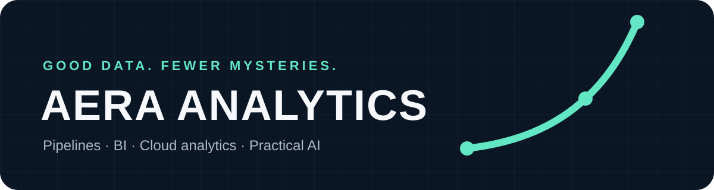

  

  <strong>Small analytics studio. Senior-level delivery.</strong> 
  Turning scattered data into sturdy pipelines, useful reporting, and decisions people can act on.

---

## What Aera does

Aera Analytics is a small independent data and analytics practice that helps teams move from “we have the data somewhere” to a system people can trust.

The work covers the full path: requirements, source mapping, technical design, SQL and Python development, ETL/ELT pipelines, data models, Tableau or Power BI, testing, deployment, and documentation.

No magic tricks. Just clear questions, well-built systems, and reporting that still makes sense on Monday morning.

## Where Aera helps

**Data pipelines and integration**  
Bring data together, automate the repeatable work, and make the handoffs reliable.

**BI and reporting**  
Build dashboards, metrics, and semantic models that answer real business questions without creating twelve new ones.

**Migrations and modernization**  
Move reporting and data workflows to stronger platforms without losing the logic the business depends on.

**Advanced analytics and automation**  
Use forecasting, machine learning, and practical AI where they improve a decision—not just because they fit in a slide deck.

**Data quality and governance**  
Add validation, reconciliation, business rules, documentation, and ownership so the solution keeps working after launch.

## How the work gets done

`Listen → Map → Build → Validate → Document → Improve`

Aera works comfortably between business and technical teams. Documentation is part of the delivery, not a scavenger hunt at the end.

## Selected work

| Project | What it demonstrates |
| --- | --- |
| [RevOps Analytics Portfolio](https://github.com/jhamm2315/revops-analytics-portfolio) | End-to-end sales, order, revenue, and margin analytics for operational and executive reporting |
| [Financial Market Intelligence](https://github.com/jhamm2315/financial-market-intelligence) | API-driven ingestion, Python, DuckDB, SQL, and multi-asset analysis |
| [Supply Chain Risk Intelligence](https://github.com/jhamm2315/supply-chain-risk-intelligence) | Shipment risk, SLA exposure, disruption signals, and decision support |
| [Customer Churn Command Center](https://github.com/jhamm2315/customer-churn-command-center) | Machine-learning workflows that identify and prioritize at-risk customers |
| [Fraud Detection Command Center](https://github.com/jhamm2315/fraud-detection-command-center) | Suspicious-transaction detection, exposure ranking, and investigator-ready outputs |

Public projects use public or synthetic data. Client data stays client data.

## Two ways to work with Aera

**For clients**  
If your reporting is held together by copy/paste and good intentions, Aera can help with a focused analytics build, migration, dashboard, or pipeline.

**For hiring teams**  
Aera is also the home of my hands-on portfolio. I’m open to full-time opportunities where I can join a team for the long haul, own delivery, learn the business, and keep improving the data environment over time.

## Tools used often

`SQL` · `Python` · `Power BI` · `Tableau` · `Microsoft Fabric` · `Azure` · `GCP` · `BigQuery` · `PostgreSQL` · `DuckDB` · `Git`

The tool follows the problem. Not the other way around.

---

  <strong>Good data. Clear decisions. Fewer mysteries.</strong> 
  <a href="https://github.com/jhamm2315?tab=repositories">Browse the work</a>

